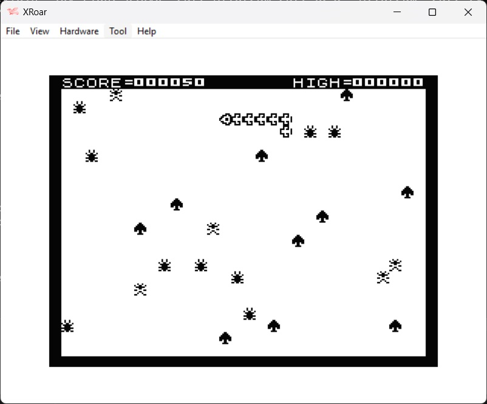

This is a 6809 assembly language one player arcade game for the Dragon 32.  The object of the game is to control the snake so that it eats grubs and beetles whilst avoing mushrooms.  The snake is controlled by the right hand joystick.

The program was written by M. North and originally published in the July 1984 edition of Your Computer Magazine.

| File | Description |
| --- | --- |
| build.bat |  A windows batch file to assemble and run the program file.  1.  Set the path to asm6809 and XROAR (change as required)    2.  Assemble the code file using asm6809   3.  Run the resulting Cupid.bin file in XROAR |
| Snakey.asm | The assembly code file |
| Snakey.cas | The assembled game file. |

Please note, asm6809 and XROAR(and associated ROMS) are not included, but can be downloaded from the following locations: 
https://www.6809.org.uk/xroar/   https://www.6809.org.uk/asm6809/

To run the game without assembling the code file:
+ Download Snakey.cas to your device
+ Open a browser and paste the following URL:  https://www.6809.org.uk/xroar/online/
+ Under the emulation screen, click the File tab
+ Click the load button, and select the downloaded Cupid.cas
+ In the emulation screen, type the following: CLOADM:EXEC   <press enter>
                

